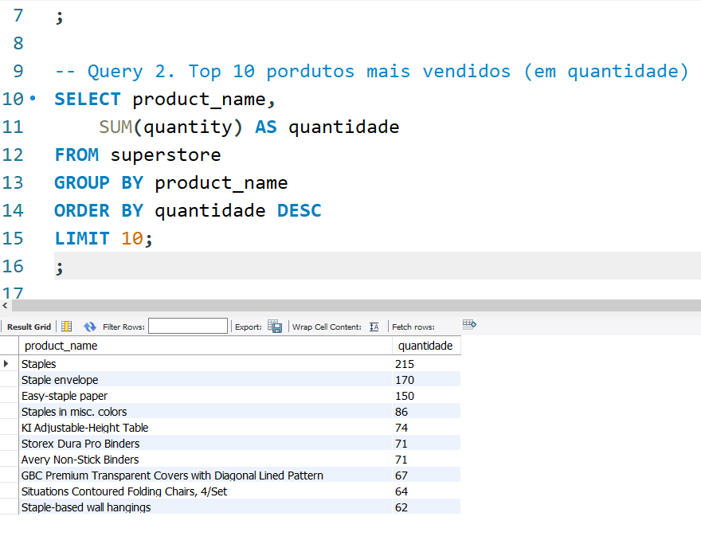
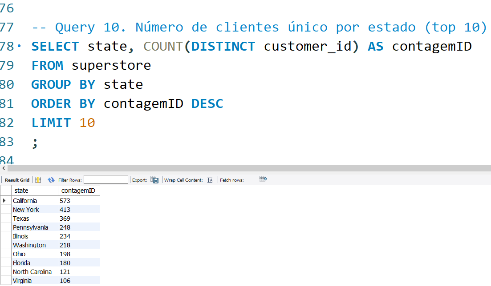
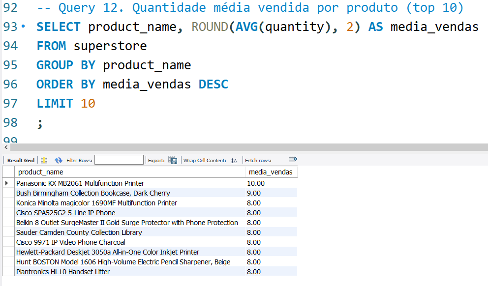

# Análise de Vendas - Superstore (SQL MySQL)

Projeto de portfólio para estágio em Análise de Dados.

## Objetivo
Analisar 4 anos de vendas da loja Superstore usando apenas SQL:
- Faturamento, lucro, ticket médio
- Top produtos e clientes
- Identificação de prejuízos e oportunidades

## Tecnologias
- MySQL
- Dataset: Sample Superstore (9.994 linhas)

## Principais Queries
- Faturamento total por ano
- Top 10 produtos mais vendidos
- Ticket médio por região
- Lucro por categoria
- Clientes acima da média geral
- Top 1 produto mais lucrativo por categoria
- E mais...

## Resultados principais

## Como rodar
1. Importe o CSV no MySQL
2. Execute o arquivo `Projeto-MySQL.sql`

Feito por: [Teu Nome]  
LinkedIn: [link do teu LinkedIn]  
Disponível para estágio em Análise de Dados (remoto ou presencial em Fernandópolis/SP)

Obrigado por visualizar meu projeto!
